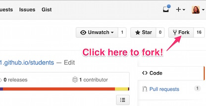
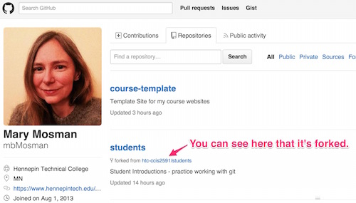
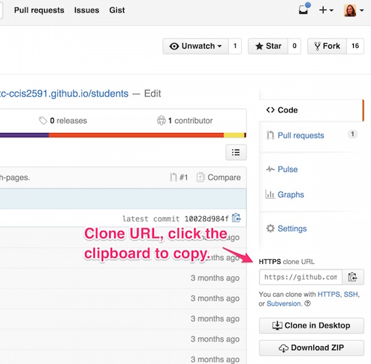
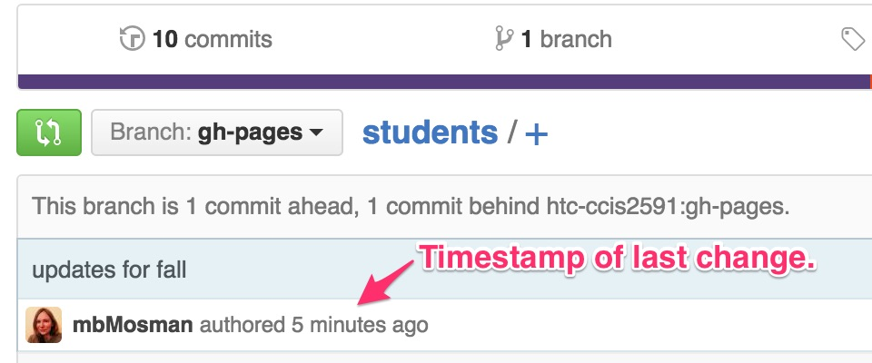
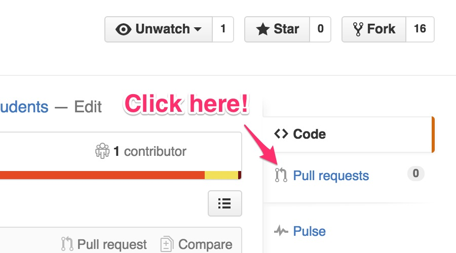
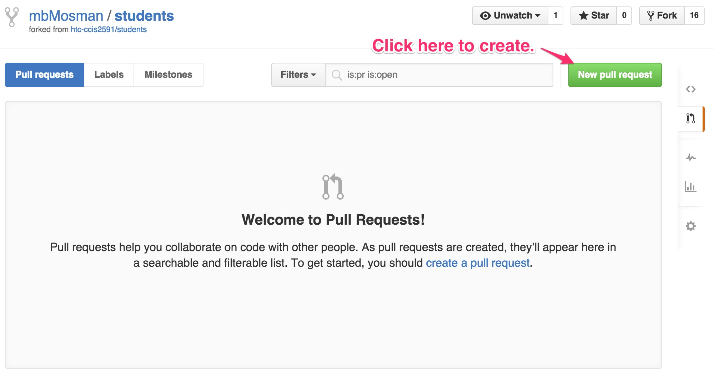

## Introduction
Throughout this course, we will be using [GitHub](http://github.com/) to manage our projects.  [GitHub](http://github.com/) allows us to have a centralized location to store and manage the projects that we will create in this class.  It also allows you to manage your own individual copy of that project, modify it as needed, and build a history of those modifications. When you are done with your work, you'll submit your project and get feedback using a *pull request*.  Understanding how to work with Git (the underlying version control system behind [GitHub](http://github.com/)) and [GitHub](http://github.com/) are very important first steps in this course.

## Get a GitHub Account
Get yourself setup with a GitHub account.  I recommend that you add your name to the account so that others can search for and find your account and repositories. The free account is fine, though if you checkout the [GitHub Student Pack](https://education.github.com/pack) you can get a micro account for free while you are a student. (To get the student stuff you'll need GitHub to know your student email. You can add more than one email to your account under Settings.)

<iframe width="560" height="315" src="https://www.youtube.com/embed/ezxRcdJ8glM?list=PLg7s6cbtAD17rhrz2BJWAPJMjR71B3IDx" frameborder="0" allowfullscreen></iframe>

Once you are registered, make sure to get me your GitHub user name so I can add you to our GitHub organization.  This will get you access to any non-public material I post for the duration of the course.

## What is GitHub and why do we use it?

<iframe src="https://player.vimeo.com/video/89542305" width="560" height="315" frameborder="0" allowfullscreen></iframe>

## Workflow
Most assignments will begin with a starter repository that you will *fork*.  This gives you a general layout for the project and any starter code that you should have to begin.  You'll then *clone* the repository to your computer, make changes and *commit* them to your local repository.  It's a good habit to commit code locally often.  This allows you to make specific notes on what you've done in the commit messages, and gives you a point to go back to if you want to undo something.  When you're done with a chunk of work, or just need to save it *in the cloud* to go home for the night, you *push* your changes up to GitHub.  To get those changes on another computer, you *fetch* or *pull* them.  When you are done with the assingment and are ready to submit it for grading, you make a *pull request*.  This allows me to get you awesome in-code feedback as I  grade.  

Let's walk through it as we get you introduced to the class.  (This will also get me your GitHub user name.)

### Fork
First you'll get your own copy of the repository, this called forking.

1. Go to our [GitHub CCIS2591 Org page](https://github.com/htc-ccis2591).  You'll notice there is a repository there called [students](https://github.com/htc-ccis2591/students).  
  

2. Click the link to go to the repository page, then click the icon in the upper right to *fork* the repository to your account.  
  

3. Now go to your GitHub page and you should see students under your repositories.  This is a copy of the repository from our class organization.  You can see the note that says it is forked.  That let's you know that it is a copy.
  

4. This is *your* copy.  The changes you make here are not made to the original repository in our organization.  

### Clone
Now you need to get the repository to your computer to work with it.  This is called cloning.  

1. Click on the students link to go to the repository page.

2. Copy the URL from the right side of the repository page.  
  

3. Next we leave the browser and go to the command prompt.  On Windows, you'll want to use the GitHub Console.  On Mac, you can just use Terminal, but you may need to install git.  I will refer to this generically as the shell.  (See the install info at the bottom to set this up on your own computer.)

4. In the shell, go to the location where you want the repository to be pulled down.  Then use the <code>git clone</code> command to get a local copy. <code>$ git clone &lt;your-clone-url-here&gt;</code>

5. Now if you list your files/directories, you will see a students directory in that location.

###  Make Changes
Now that you've got a copy, you can make changes to the original files.  You edit the files as you would any other code, using whatever editor you prefer.  (In the classroom, we have [Brackets](http://brackets.io/) installed for you.)  When you're ready to save a change, you'll make a commit.

1. Let's add your information to the directory.  Go into the students directory.  You should see an _data directory with a subdirectory for the current semester.  

2. Make a copy of my *mbmosman.yml* file and edit the name so that it is __*your GitHub*__ user name.

3. Open the file in an editor and update the contents to include information about you.  Here's a list of the [emoji](http://www.emoji-cheat-sheet.com/) you can use.  Be careful with the formatting.  It's key / value pairs, with the key followed by a colon (:) and then the value.  Each should be on its own line.  This is [YAML](http://www.yaml.org/start.html) data.

4. In most cases, you'd now test to make sure things look OK.  While you could test this locally, there's some extra set up needed for this type of Jekyll GitHub Pages site.  (Look it up later if you are curious.  This is how the course web site is built too.)  We'll skip the testing and just commit our change, but you might need to come back later and fix it if you weren't careful.

5. When you're done, it's back to the command line.  Use the <code>git status</code> command to see what changes you have made. <code>$ git status</code>

5. You should see that you've got an untracked file.  Use the <code>git add</code> command to add your file.  You can append the file name to the command to add a single file, or you can add a . to add all the new files at once. <code>$ git add &lt;your-file-name-here&gt;</code> OR  <code>$ git add .</code>

6. Use git status to verify that you're file has been added.  

7. Now it's time to commit the change.  This will version your change in your local git repository.  Use the <code>git commit</code> command. <code>$ git commit -m "Your message about the change here."</code>

8.  It's good to commit small groups of changes with specific messages.

### Push Changes
To get your changes from your local repository to the GitHub repository you do a push.

1. Before you push your changes, you should check that the branch you are on matches the remote branch you want to push to. It will often be master in the real world, but for many of our class assignments, which are web pages we want GitHub to host for us, it will be gh-pages.  You can see which branch you are working on by using the <code>git branch</code> command.

2. If your local and remote branches match, then you can just say <code>git push</code> and everything should go up to GitHub.

3. If your local and remote branches are different, then you need to say which remote branch you want to push to: <code>$ git push origin <remote-branch-here></code>

4.  Check the GitHub repository page in the browser to make sure you got the changes up successfully.  
  

### Pull Request
The changes are still on your copy of the students repository.  To get them back to the course organization repository you will create a pull request.  This is the last step - the part that turns in your assignment.

1. From your repository page, click the Pull Requests tab (found along the right side).  
  

2. Click the green button to create a new pull request.
  

3. The next screen will show you all the changes between your copy of the repository and the original.  Review the changes, then click the green button to create the request.

4. The next page allows you to enter a commit message and (optionally) comments for the reviewer.  

## Installing Git at Home
In the classroom, git will be installed for you, but you will  also want to have this installed on the computer you will be working on at home.  Git is fairly easy to install;  follow the instructions below for your operating system.

### Install on Windows
On Windows, the simplest option is to install [GitHub for Windows](http://windows.github.com).  This includes a command line version of Git as well as the GitHub GUI. We will be working with git from the command line, so you'll want convenient access to the *Git Shell*.  You may want to add this as a shortcut on your desktop or pin it to the start menu or taskbar.

We will focus on using git from the command line, as this is a more portable and marketable skill. The GitHub UI is nice, but on the job, it is unlikely your repository will be on GitHub, so you don't want to become dependent on this interface.

### Install on Mac
If you are using a Mac, open up a [Terminal]({{ "/documents/mac-terminal.html" | prepend:site.baseurl }}) window and type git.  You may find that it is already installed, or if not that it will prompt you to install the XCode Command Line Developer Tools.  If it does not, you likely have an older version of the Mac OS and should download and install the tools from the [Apple Developer Site](https://developer.apple.com/downloads/index.action).  You can also install the full XCode suite from the Apple App Store, but this will take additional space.  

### Install on Linux
If you are on a Linux system, I'm going to assume that you know how to use your package manager - on a Debian system this would be apt-get.  Using the package manager for your system, install git.

$ sudo apt-get install git


## Configure Git
Before you dive in, you'll want to configure git with your user information. In the commands below, fill in your name and the email you used with your GitHub account.  This email is what will tie your activity to your account.  **Make sure that you are using the same email and check for typos.**

$ git config --global user.name "User Name"
$ git config --global user.email "user@email"


## Using a portable Drive
Since our classroom computers are wiped on reboot, it's a good idea to work off a portable drive while in class. If you choose to do this, you can configure git locally for each repository, then that configuration can be carried over into the classroom.  You can't do this now, since you don't have a repository yet, but keep this in mind for later.

$ git config --local user.name "User Name"
$ git config --local user.email "user@email"

